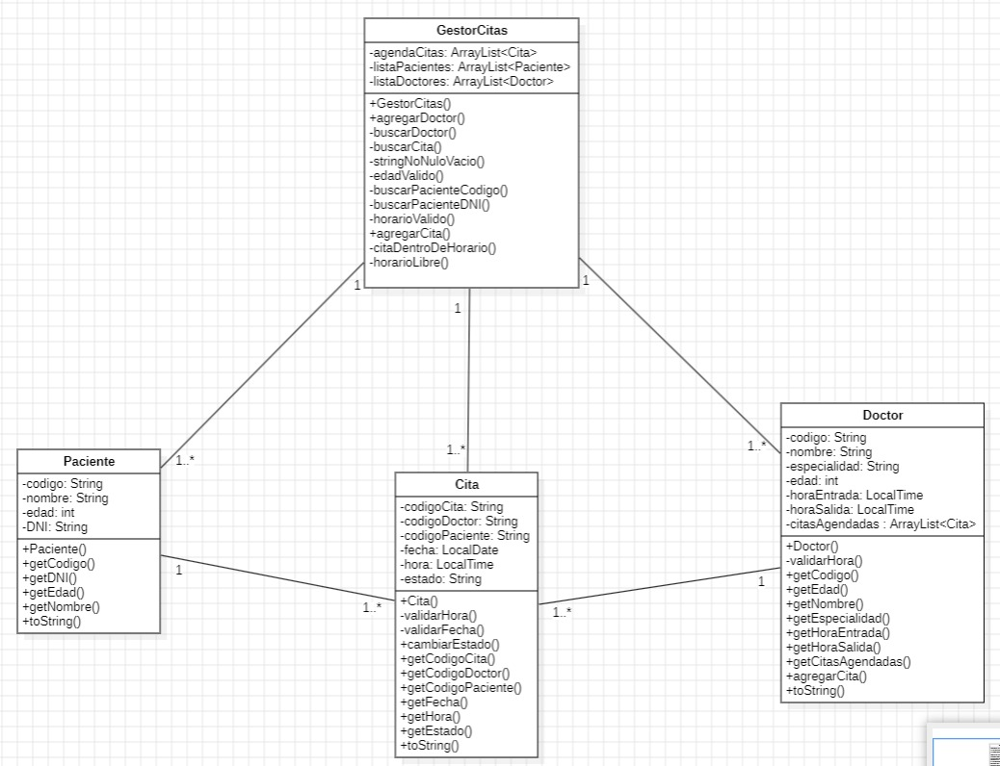

# 🏥 Laboratorio — Sistema de Citas Médicas  
**Resolviendo el Cuestionario**
---

## 📘 1. Cuestionario

### **1. ¿De qué manera la Programación Orientada a Objetos facilita el desarrollo, mantenimiento y ampliación del Sistema de Citas Médicas frente a un enfoque estructurado tradicional?**

La **Programación Orientada a Objetos (POO)** facilitó el desarrollo porque permitió estructurar el sistema de forma más **modular y clara**.  
Cada entidad del sistema —como `Doctor`, `Paciente` o `Cita`— se modeló como una **clase independiente**, con sus propios atributos y comportamientos, lo que hace el código más ordenado y fácil de mantener.

Una gran ventaja fue la **reutilización de código**: varios métodos, como los de validación o registro, pudieron utilizarse múltiples veces sin necesidad de duplicarlos.  
Además, la POO permitió **extender el sistema sin afectar su funcionamiento actual**, agregando nuevas clases o funcionalidades sin modificar las existentes.

En contraste, un enfoque estructurado habría requerido modificar muchas secciones del código para cada cambio, volviéndolo más frágil y difícil de escalar.  
Gracias a la POO, el sistema es más **robusto, legible y fácil de ampliar**.

---

### **2. ¿Qué dificultades encontraste al traducir tu diagrama de clases UML al código Java? Explica qué decisiones de diseño tuviste que modificar durante la programación y por qué.**

Al traducir el diagrama UML al código Java surgieron varias dificultades prácticas.  
Algunos métodos o atributos que en UML parecían simples se complicaron en la implementación, sobre todo los relacionados con el uso de **ArrayList**, **Scanner** y el manejo de objetos.

Una de las decisiones más importantes fue **cambiar métodos estáticos por métodos de instancia**, ya que necesitaban manipular datos específicos de cada objeto y no información general de la clase.  
También se **simplificaron algunas asociaciones** entre clases para evitar dependencias innecesarias y facilitar la ejecución del programa.

En resumen, el **diagrama UML sirvió como guía**, pero fue necesario adaptarlo a las restricciones y buenas prácticas del lenguaje Java, buscando equilibrio entre diseño teórico y viabilidad práctica.

---

### **3. ¿Cómo distribuyó tu grupo el trabajo entre diseño, programación y pruebas? Menciona una práctica de equipo que consideres importante para mejorar la calidad del software y otra que debería evitarse.**

La distribución del trabajo se realizó de forma colaborativa:
- Algunos integrantes se encargaron del **diseño** y elaboración del **diagrama UML**.  
- Otros trabajaron en la **implementación en Java** y las **pruebas funcionales** del sistema.  
- Finalmente, se integró el código y se realizó una revisión conjunta para asegurar la coherencia del proyecto.

Una práctica positiva fue el **uso de control de versiones (GitHub)**, junto con una **comunicación constante** dentro del equipo.  
Esto evitó la pérdida de archivos y permitió unificar el trabajo sin conflictos de versiones.

Por otro lado, una práctica que debe evitarse es **programar sin seguir el diseño acordado**, ya que esto genera inconsistencias y dificulta la integración final.  
La coordinación entre diseño y desarrollo es clave para mantener la calidad del software.

---

## 🧩 2. Diagrama UML del Sistema de Citas Médicas

A continuación se muestra el diagrama UML que representa las clases principales del sistema y sus relaciones:

**Descripción general del diseño:**
- `GestorCitas` actúa como clase principal de control, gestionando doctores, pacientes y citas.  
- `Doctor`, `Paciente` y `Cita` son las entidades fundamentales del sistema, cada una con sus atributos y métodos específicos.  
- Las asociaciones reflejan las relaciones uno-a-muchos entre los gestores y los elementos del sistema (por ejemplo, un doctor puede tener muchas citas).

---

## 💡 3. Conclusión

El **Sistema de Citas Médicas** permitió aplicar los conceptos esenciales de la **Programación Orientada a Objetos**, desde el diseño UML hasta la implementación en Java.  
Durante el proceso se consolidaron competencias en **modelado, encapsulamiento, validación y colaboración entre clases**.  
A pesar de los ajustes necesarios durante la codificación, el sistema final es modular, escalable y de fácil mantenimiento, reflejando un desarrollo orientado a buenas prácticas.

---

## ✍️ Autores

**Gian Franco Apaza Quispe**  
**Josué Enrique Camero Elguera**  
**Marco Antonio Salas Zegarra**  
**Johan Jeremy Yucra Ticona**  

---

## Docente
**Saire Peralta Edwar Abril**

Curso: *Desarrollo de Sistemas Orientados a Objetos (DSOO)*  
Universidad Nacional de San Agustín de Arequipa – Escuela Profesional de Ingeniería de Sistemas  
Año académico: 2025
